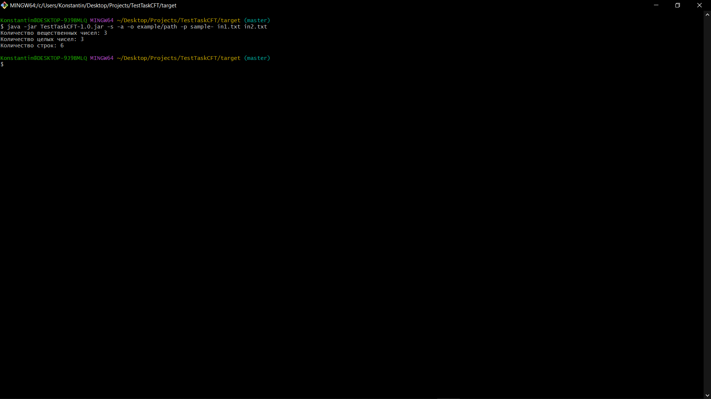
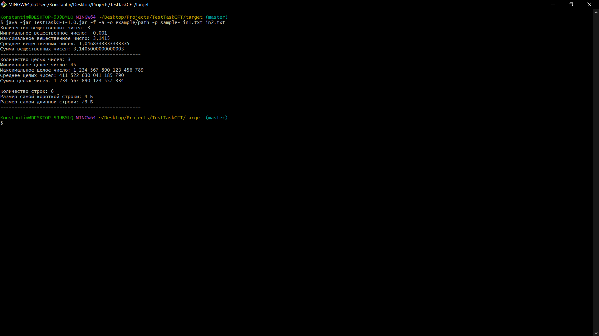

<h2>Тестовое задание для ЦФТ ШИФТ (курс Java)</h2>

<h3>Инструкция по запуску:</h3>
<ol>
<li>С помощью терминала, в папке с проектом выполнить команду: mvn clean package </li>
<li>Перейти в папку target с помощью команды: cd target</li>
<li>В папку с jar файлом (target) необходимо поместить входной/входные файлы в формате txt. Файлы можно скопировать из папки /src/main/resources командой: cp src/main/resources/*.txt target</li>
<li>Запустить jar файл с помощью команды: java -jar TestTaskCFT-1.0.jar (необходимо указать обязательные аргументы командной строки. Описание возможных аргументов приведено ниже)</li>
<li>(Опционально) Для отдельного запуска тестов, в папке с проектом можно выполнить команду: mvn clean test</li>
</ol>

<h3>Используемые технологии:</h3>
<ul>
<li>Java 17 Amazon Corretto 17.0.8</li>
<li>Maven 3.9.4</li>
<li>Lombok 1.18.30</li>
<li>JUnit5 5.10.2</li>
<li>Mockito 5.10.0</li>
</ul>

<h4>Ссылки mvnrepository для используемых библиотек:</h4>
<ul>
<li>https://mvnrepository.com/artifact/org.projectlombok/lombok/1.18.30</li>
<li>https://mvnrepository.com/artifact/org.junit.jupiter/junit-jupiter-api/5.10.2</li>
<li>https://mvnrepository.com/artifact/org.junit.jupiter/junit-jupiter-engine</li>
<li>https://mvnrepository.com/artifact/org.mockito/mockito-core/5.10.0</li>
<li>https://mvnrepository.com/artifact/org.apache.maven.plugins/maven-jar-plugin/3.3.0</li>
<li>https://mvnrepository.com/artifact/org.apache.maven.plugins/maven-surefire-plugin/3.2.5</li>
</ul>

<h3>Аргументы командной строки:</h3>
<h4>Необязательные аргументы:</h4>
<ul>
<li>-o example/path (необязательный аргумент, указывающий путь к выходным файлам относительно jar файла.
Для указания в пути родительских папок используются "..". Например ../example/path)</li>
<li>-p result_ (необязательный аргумент, указывающий префикс выходных файлов)</li>
<li>-a (необязательный аргумент, при вводе данного аргумента выходные файлы не перезаписываются(если
выходные файлы с такими именами существуют), а новые строки добавляются в конец файлов)</li>
<li>-s (необязательный аргумент, при вводе данного аргумента выводит краткую статистику в консоль)</li>
<li>-f (необязательный аргумент, при вводе данного аргумента выводит подробную статистику в консоль)</li>
</ul>

<h4>Обязательные аргументы:</h4>
<ul>
<li>example1.txt (обязательный аргумент, указывающий на имя входного файла в формате txt. Файл должен находиться в папке с jar файлом. Можно указать несколько входных файлов через пробел)</li>
</ul>

<h4>Пример введеных аргументов:</h4>

java -jar TestTaskCFT-1.0.jar -f -a -o example/path -p sample- in1.txt in2.txt

<h3>Примеры работы вывода статистики:</h3>
<h4>Краткая статистика:</h4>

<h4>Полная статистика:</h4>

